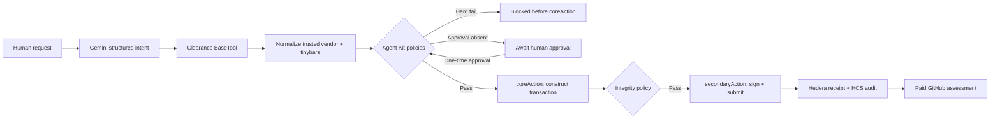

# Clearance

> Finance-grade approvals for AI agents that spend money.

Clearance is a policy and approvals control plane for agentic spending on Hedera. A Gemini-powered agent can request a real repository security assessment, but it cannot choose a destination account, authorize itself, or bypass deterministic controls. Every payment travels through a custom Hedera Agent Kit v4 `BaseTool`, where Hooks and Policies can stop execution before a transaction is constructed or submitted.

**Week 5 — Hedera Policy Agent · Hedera testnet · HBAR only**

## Why Clearance

Companies will not give autonomous agents unrestricted treasury access. They need spend limits, approved counterparties, allowed purchase purposes, contextual review, explicit human authorization, and evidence showing exactly where a request stopped. Clearance demonstrates that control plane using the runtime primitives the Hedera Agent Kit was designed to provide.

Clearance is not a payment chatbot. The model proposes structured intent; deterministic code owns authority.

## Live demo flows

| Scenario | Expected result | Enforcement |
| --- | --- | --- |
| Buy a 1 HBAR dependency scan from SecureScan Labs | `REQUIRES_APPROVAL`, then real testnet transfer | Human approval policy blocks before `coreAction` until the user clicks approve |
| Send 25 HBAR to UnknownVendor | `BLOCKED` | Amount, daily budget, and vendor policies fail; no payment transaction is constructed |
| Buy a 4 HBAR production smart-contract audit | `REQUIRES_APPROVAL` | Risk policy requires the typed phrase `APPROVE 4 HBAR` |

After a confirmed payment, Clearance performs a real GitHub API assessment of `shobhit1kapoor/signalops-demo`. Blocked or unpaid requests never receive the report.

## Verified testnet evidence

The complete approved flow was exercised against Hedera testnet on June 21, 2026:

- Treasury: [`0.0.9295451`](https://hashscan.io/testnet/account/0.0.9295451)
- SecureScan Labs vendor: [`0.0.9295531`](https://hashscan.io/testnet/account/0.0.9295531)
- Approved 1 HBAR payment: [`0.0.9295451@1782018671.886760509`](https://hashscan.io/testnet/transaction/0.0.9295451%401782018671.886760509)
- HCS audit topic: [`0.0.9295532`](https://hashscan.io/testnet/topic/0.0.9295532)
- Compact decision proof: [`0.0.9295451@1782018672.202568545`](https://hashscan.io/testnet/transaction/0.0.9295451%401782018672.202568545)

The topic contains both the official `HcsAuditTrailHook` entry and Clearance's compact, hash-linked policy decision proof.

## Architecture



### Official seven-stage lifecycle

| Stage | Clearance behavior |
| --- | --- |
| 1. Pre-tool hook | Trusted request context and raw intent recorded |
| 2. Normalize | Vendor alias resolves server-side; HBAR becomes integer tinybars |
| 3. Post-normalization hook | All policy verdicts are captured before the first policy can throw |
| 4. Core action | Unsigned `TransferTransaction` is constructed |
| 5. Post-core hook | Transaction integrity policy compares it with the approved intent |
| 6. Secondary action | `handleTransaction` signs and submits on testnet |
| 7. Post-tool hook | Receipt is recorded and the official HCS audit hook runs |

Hooks are registered in `Context` and dispatched automatically by `BaseTool`; application code never calls lifecycle hooks manually.

## Runtime policies

- **MaxSpendPolicy** — 5 HBAR per transaction.
- **DailyBudgetPolicy** — 20 HBAR per UTC day with an atomic Postgres claim.
- **VendorAllowlistPolicy** — recipient comes from the server-side vendor registry, never the LLM.
- **PurposePolicy** — security scan, audit report, API service, or data lookup only.
- **TokenPolicy** — HBAR only. USDC is deliberately not represented as enabled.
- **RiskPolicy** — production and audit contexts require amount-bound elevated confirmation.
- **HumanApprovalPolicy** — every payment needs explicit prior authorization.
- **TransactionIntegrityPolicy** — the constructed transaction must match the approved normalized intent.

The Agent Kit is deliberately configured with only `clearancePlugin`; using `allCorePlugins` would unnecessarily expose unrelated treasury operations.

## Safety model

- The browser, model, and tool parameters cannot provide approval state.
- The model supplies a vendor name, never a Hedera destination account.
- Approval is a same-origin, session-bound, one-time database transition.
- Requests expire after 15 minutes and can execute only once.
- Public demo execution is capped by transaction, daily workspace, and hashed-IP limits.
- Amounts are stored and compared as integer tinybars.
- No raw IP address is persisted.
- Mainnet is not supported; the client is fixed to Hedera testnet.
- No report, receipt, HashScan link, or immutable-audit claim appears without real evidence.

See [SECURITY.md](SECURITY.md) and [docs/THREAT_MODEL.md](docs/THREAT_MODEL.md).

## Stack

- Next.js 15, React 19, TypeScript, Tailwind CSS, Framer Motion
- Hedera Agent Kit core 4.0.0 and AI SDK adapter 1.0.0
- Hiero SDK 2.81+, Vercel AI SDK 6.0.86, Gemini 2.5 Flash
- Neon/Postgres with a safe volatile fallback for local UI evaluation
- Vitest and Playwright

## Local setup

```bash
npm install
cp .env.example .env.local
npm run dev
```

Open `http://localhost:3000`. Without external credentials, policy evaluation works and payment attempts fail closed with an honest configuration message. For a live transfer, populate the testnet-only variables documented in `.env.example`.

Create the HCS topic before deployment and put its ID in `HEDERA_HCS_TOPIC_ID`. The operator must be permitted to submit messages. Do not use a paid HIP-991 topic unless the audit client is intentionally funded for its fees.

## Verification

```bash
npm run typecheck
npm test
npm run build
npm run test:e2e
npm audit
```

The highest-value invariant is covered by a spy test: blocked and unapproved calls never enter `coreAction` or `secondaryAction`.

## API

- `POST /api/requests` — validate and evaluate purchase intent.
- `GET /api/requests/:id` — retrieve session-owned evidence.
- `POST /api/requests/:id/approve` — atomically authorize and execute once.
- `POST /api/requests/:id/audit/retry` — idempotently retry an HCS decision record.
- `GET /api/health` — report configuration readiness without exposing secrets.

## Honest limitations

- This hackathon MVP has one approved vendor and one real service.
- HBAR is the only enabled settlement asset.
- The built-in HCS audit hook supports `AUTONOMOUS` mode only, so the transaction preview is derived from normalized intent rather than `RETURN_BYTES`.
- Postgres is required for durable hosted controls; the memory store exists only for local evaluation.
- GitHub evidence quality depends on API permissions and rate limits.
- Testnet assets have no monetary value. No mainnet key should ever be used.

## Campaign compliance

- Built during the May 18–June 21, 2026 campaign period with incremental Git history.
- Public repository and hosted agent intended to remain available for at least 90 days.
- Hedera Agent Kit is a core dependency and execution boundary.
- AI-generated code is reviewed and tested by the entrant.
- Required feedback draft: [docs/FEEDBACK_ISSUE.md](docs/FEEDBACK_ISSUE.md).
- Third-party packages retain their respective licenses; the primary Hedera packages are Apache-2.0 licensed.

## License

MIT © 2026 Shobhit Kapoor
